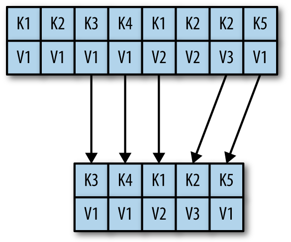
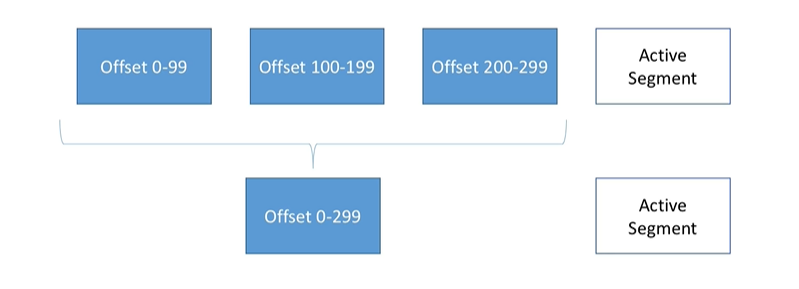

# Kafka - Level 0
This is recipe based training on Apache Kafka for ArcExL. Level-0 covers basic concepts of Kafka. KStreams and KConnect are out of scope for this training. 

## Overview

Here is a brief overview of what we are going to build.


1. StockPriceApp-Prod is going to read stock prices from Feeds - which is actually a csv [committed to the repo](/record-replay/src/main/resources/feeds.csv)
1. StockPriceAdd-Prod writes these stock prices to prod-DB
1. It also writes to stockPriceTopic at Kafka
1. StockPriceApp-Uat is reading the stock prices from stockPriceTopic at Kafka
1. StockPriceApp-Uat writes the stock prices read from kafka to uat-DB

-------------

## How the course is aligned

* The incremental steps needed to build the application is modeled as **Recipe**
* Each recipe has **Focus Points** - i.e. what you should learn out of building that recipe.
* After every recipe or bunch of recipes, we have **Checkpoints** - i.e. Summary of everything you know about Kafka up until now. 
We stop at each Checkpoint, drive the points home and THEN move on to further recipes. Because understanding these checkpoints are crucial for recipes that follow.

## Setup
* IDE - We prefer that you work on Intellij
* Gradle
* Java 8 or above/Kotlin
* Spring/Spring Boot
* Postgres DB
  * Create 2 databases - `arcexl_prod`, `arcexl_uat`
  * Create `arcexl` schema in both DBs
  * Create superuser `postgres` with password `admin`
* Dbeaver 
* Kafka (latest : 2.5.0)
--------------------

<details>
<summary>Postgres Linux Installation</summary>

#### Set your local postgres working directory - do this in every new terminal window / shell
`export TEST_PG_ROOT=/codemill/$USER/postgres`
#### Create postgres working directory if it doesn't exist - this only needs to be done once
`mkdir -p $TEST_PG_ROOT`
#### Download Postgres .tar.gz - this only needs to be done once
* `wget https://sbp.enterprisedb.com/getfile.jsp?fileid=12354 -O $TEST_PG_ROOT/pgsql.tar.gz`
* `tar xzf $TEST_PG_ROOT/pgsql.tar.gz`
#### Initialize the database - this only needs to be done once
* `rm -rf $TEST_PG_ROOT/db`
* `mkdir -p $TEST_PG_ROOT/db`
* `$TEST_PG_ROOT/pgsql/bin/initdb $TEST_PG_ROOT/db`
#### Start a local postgres server - this runs postgres in the foreground, can be shut down with ctrl-c and restarted as many times as you'd like
`$TEST_PG_ROOT/pgsql/bin/postgres -D $TEST_PG_ROOT/db --unix_socket_directories=$TEST_PG_ROOT --wal_level=minimal --archive_mode=off --max_wal_senders=0 --checkpoint_timeout=30 --archive_command=/bin/true --max_wal_size=256MB`
#### Connect via psql - optional to test that your server works. You can also use dbeaver
`$TEST_PG_ROOT/pgsql/bin/psql --host=$TEST_PG_ROOT -d postgres`
#### Create user and assign password and provide owner permissions to run DDLs via flyway - username & password should match the properties mentioned in application.properties
```
 CREATE USER postgres SUPERUSER;
 CREATE DATABASE arcexl_prod WITH OWNER postgres;
 CREATE DATABASE arcexl_uat WITH OWNER postgres;
 ALTER USER postgres WITH PASSWORD 'admin';
```
#### Create schema arcexl in both prod and uat DB
```
$TEST_PG_ROOT/pgsql/bin/psql -U postgres
\l <to list database>
\c <db_name> 
CREATE SCHEMA IF NOT EXISTS arcexl; 
```

</details>

-----------------
<details>
<summary>Postgres windows installation</summary>

* initdb
```
C:\Users\vino\Downloads\pgsql\bin>initdb -D "C:\Users\vino\Downloads\pgsql\datadir"
The files belonging to this database system will be owned by user "vino".
This user must also own the server process.

The database cluster will be initialized with locale "English_United States.1252".
The default database encoding has accordingly been set to "WIN1252".
The default text search configuration will be set to "english".

Data page checksums are disabled.

creating directory C:/Users/vino/Downloads/pgsql/datadir ... ok
creating subdirectories ... ok
selecting dynamic shared memory implementation ... windows
selecting default max_connections ... 100
selecting default shared_buffers ... 128MB
selecting default time zone ... Asia/Calcutta
creating configuration files ... ok
running bootstrap script ... ok
performing post-bootstrap initialization ... ok
syncing data to disk ... ok

initdb: warning: enabling "trust" authentication for local connections
You can change this by editing pg_hba.conf or using the option -A, or
--auth-local and --auth-host, the next time you run initdb.

Success. You can now start the database server using:

    pg_ctl -D ^"C^:^\Users^\vino^\Downloads^\pgsql^\datadir^" -l logfile start
```
* Start postgres server	
```
C:\Users\vino\Downloads\pgsql\bin>pg_ctl -D "C:\Users\vino\Downloads\pgsql\datadir" start
```

* Use client (or use dbeaver) and give permissions to user "postgres" and assign password too.
```
C:\Users\vino\Downloads\pgsql\bin>psql -d postgres
psql (12.2)
WARNING: Console code page (437) differs from Windows code page (1252)
         8-bit characters might not work correctly. See psql reference
         page "Notes for Windows users" for details.
Type "help" for help.

postgres=# CREATE USER postgres SUPERUSER;
CREATE ROLE
postgres=# ALTER USER postgres WITH PASSWORD 'admin';
ALTER ROLE
postgres=# CREATE DATABASE arcexl_prod WITH OWNER postgres;
postgres=# CREATE DATABASE arcexl_uat WITH OWNER postgres;
```

* Create schema in each DB
```
C:\Users\vino\Downloads\pgsql\bin>psql -U postgres
postgres=# \c arcexl_prod
You are now connected to database "arcexl_prod" as user "postgres".
arcexl_prod=# create schema if not exists arcexl;
```

</details>

------------------

<details>
<summary>Connecting to postgres from Dbeaver</summary>

* New -> Dbeaver -> Database Connection -> PostgreSQL
* Host : localhost 
* Port : 5432
* Database : arcexl_prod or arcexl_uat
* User : postgres
* password : admin (select save password locally)
</details>

---------

## Recipe 1 - Setting up a Spring project

### Exercise

* Set up spring dependencies in gradle
* Add domain object for StockPrice
```
data class StockPrice(val stockSymbol: String,
                         val date: LocalDate,
                         val price: Double)
```
* create table `stock_price`
```
CREATE TABLE IF NOT EXISTS stock_price (
                    stock_symbol varchar(100),
                    "date" date,
                    price numeric,
                    constraint stock_price_pk primary key (stock_symbol, "date")
                    )
```
* DAO support 

```
public interface StockPriceDao {
    void insertStockPrice(StockPrice stockPrice);
    StockPrice selectStockPrice(String stockSymbol, LocalDate date);
    List<StockPrice> selectAllStockPrice();
    void deleteStockPrice(String stockSymbol, LocalDate date);
}
```

* Support prod and uat profile to connect to the respective databases
* Test the DAO methods - if you are connected to prod/uat to run test, the test data should be rolled back after each (successful/failed) test

### Module
Name : setup

### Focus Points
* Clearing test data after each run
* Kotlin data classes and extension functions
* Kotlin test
* Check out the DAO Implementation at kotlin - delegate pattern
* Mybatis annotation mappers
* Flyway

Note that it is not 100% kotlin. I don't want to add another learning curve here. If you already know a little Kotlin, some features I have used here would be an useful reference to you.
**It is not mandatory to stick to the module provided here**. All we need at this point, is to have an application that connects to prod/uat db based on the profile and supports read/write dao on stock_price table.  

------------ 

## Recipe 2 - Setting up Kafka

### Installation & Creating Brokers

As few of you don't have Linux setup, I am explicitly doing Kafka Windows installation so that I can help unblock you with installation issues, if any.

* Download and extract the latest kafka.
* Open CMD and navigate to <kafka>/bin/windows
* Execute `kafka-topics.bat` 
    * If you see `The input line is too long. The syntax of the command is incorrect.` error, then rename you kafka folder from `kafka_2.12-2.5.0` to `kafka`
    * Reopen CMD and try again
* Create a folder `arcexlData` under `kafka` folder
    * create 2 folders under  `arcexlData` - `zookeeper` and `kafka`
    ```
    kafka
    |______bin
    |______config
    |______arcexlData
            |________kafka
            |________zookeeper
    ```
* Edit `zookeeper.properties` under `kafka/config` - Mind the forward slash
`dataDir=C:/Users/vino/Downloads/kafka/arcexlData/zookeeper`
* Edit `server.properties` under `kafka/config`
`log.dirs=C:/Users/chockali/Downloads/kafka/arcexlData/kafka` 
* Open a new CMD window and Start Zookeeper
`C:\Users\vino\Downloads\kafka>bin\windows\zookeeper-server-start.bat config\zookeeper.properties`
    * You should see that it is binding to port 2181
    
        ```[2020-05-17 01:23:56,813] INFO binding to port 0.0.0.0/0.0.0.0:2181 (org.apache.zookeeper.server.NIOServerCnxnFactory)```
  
* Open another new CMD window and Start Kafka Server
`C:\Users\vino\Downloads\kafka>bin\windows\kafka-server-start.bat config\server.properties`
    * Notice the ID `[2020-05-17 01:46:44,435] INFO [KafkaServer id=0] started (kafka.server.KafkaServer)`

On a side note, [future versions of Kafka will not use Zookeeper](https://cwiki.apache.org/confluence/display/KAFKA/KIP-500%3A+Replace+ZooKeeper+with+a+Self-Managed+Metadata+Quorum)

What you have now is a Kafka Broker.

----------------
### Creating Topics

* Create a topic with name - stockPriceTopic, partitions - 3, replication-factor - 2
    ```
    C:\Users\vino\Downloads\kafka>bin\windows\kafka-topics.bat --zookeeper 127.0.0.1:2181 --topic stockPriceTopic --create --partitions 3 --replication-factor 2
    Error while executing topic command : Replication factor: 2 larger than available brokers: 1.
    [2020-05-17 01:41:55,770] ERROR org.apache.kafka.common.errors.InvalidReplicationFactorException: Replication factor: 2 larger than available brokers: 1.
     (kafka.admin.TopicCommand$)
    ```
* Notice the error message. In previous exercise you have only created 1 broker but you are asking the partitions to be replicated at 2. That's why the error. For now let's keep replication-factor=1. Note that since you are running kafka locally, increasing broker for this exercise does not make any sense. There is no point increasing brokers for resilience - if your system crashes, you will lose all brokers. 
    ```
   C:\Users\vino\Downloads\kafka>bin\windows\kafka-topics.bat --zookeeper 127.0.0.1:2181 --topic stockPriceTopic --create --partitions 3 --replication-factor 1
  Created topic stockPriceTopic.
    ```
* List the topics
    ```
     C:\Users\vino\Downloads\kafka>bin\windows\kafka-topics.bat --zookeeper 127.0.0.1:2181 --list
    stockPriceTopic
    ```
* Describe the topic. You will see buzzwords : Partition, replicationFactor, Leader, ISR (In-Sync Replicas) - we will get to it soon. Note that the leader : 0 is nothing but the `kafka-server` we ran (go back check the logs at kafka-server cmd window)
    ```
    C:\Users\vino\Downloads\kafka>bin\windows\kafka-topics.bat --zookeeper 127.0.0.1:2181 --topic stockPriceTopic --describe
    ```
* If you are curious, figure out what it takes to increase replication factor of this topic and do that as an exercise. Hint : [Multi broker cluster](https://kafka.apache.org/quickstart#quickstart_multibroker)
* In windows, never delete a topic. This crashes Kafka Broker and [this is a known issue.](https://issues.apache.org/jira/browse/KAFKA-1194)

This concludes the installation.

### Checkpoint - Broker and Topics

With installation, we have seen 2 major components of Kafka - Broker and Topics

* A number of Brokers makes a Kafka cluster. 
    * Each broker is identified by an id - we saw ID : 0 in our setup.
    * They can discover each other because of Zookeeper.
* Topic holds the data and it can have many partitions.
    * Broker houses Topic partitions. Eg :
        * you have 2 brokers - B1 & B2 
        * A topic of 3 partitions - P1, P2 & P3. 
        * Broker B1 has [P1, P2]. 
        * Broker B2 has [P3]
    * Each Partition can have only one Leader and *only that leader* can receive and serve data for that partition. 
    * If you set replication factor as n for topic, it means each partition gets replicated n times.
        * Topic with P1, P2
        * Broker - B1, B2
        * Replication Factor = 2
        * B1 has [P1, P2'] and B2 has [P2, P1']
        * B1 is leader for P1 and B2 is syncing data from B1 for partition 1 and therefore it is an ISR - In Sync Replica
        * B2 is leader for P2 and B1 is ISR for P2
        * If B1 is down, then B2 can serve data. i.e B2 becomes leader for both P1 and P2

_You should understand broker, topic, partition, replication factor, Leader, ISR before going to the next step._

<details>
<summary>Visualizations</summary>


---------------------------


---------------------------


</details>

### Exercise

Using the CLI Commands,
* Create a topic - test with 3 partitions
* Use `kafka-console-producer` to produce some messages into this topic - 1,2,3,4,...20
    ```
  C:\Users\vino\Downloads\kafka>bin\windows\kafka-console-producer.bat --broker-list 127.0.0.1:9092 --topic test
    ``` 
    * How are you able to discover broker at 9092. Hint : Look into `config/server.properties`
    * Can you produce to a topic that does not exist? Hint : Look for `num.partitions` in server.properties file.
* Kill the kafka-console-producer command
* Now use `kafka-console-consumer` to consume the messages produced.
    * Can you see the numbers you produced? No?
    * Run the kafka-console-producer again and produce messages : 21,22,23,..25.
    * Why can you only see from 21?
    * Hint: `--from-beginning`
* Why the numbers are not in order?
    * Hint : Number of partitions you set for the test topic

-------------

## Recipe 3 - Producing messages into Kafka

### Exercise
* Make sure stockPriceTopic is created with 3 partitions.
* Add an implementation for `StockPriceWriter` interface

    ```
    public interface StockPriceWriter {
        void writeStockPrice(StockPrice stockPrice);
    }
    ```
* This implementation should write to DB and then to Kafka using Kafka Producer API
* Also, it should only write to Kafka if `writeStockPriceToKafka` property is set to true
* At prod profile, set `writeStockPriceToKafka` to true and at uat profile, set this to false
* Add an implementation for `StockPriceReader` interface. This implementation should read stockPrice from [feeds.csv](/record-replay/src/main/resources/feeds.csv) file. 

    ```
    public interface StockPriceReader {
        List<StockPrice> read();
    }
    ```
    * Do not waste too much time on this implementation. You need opencsv - version 5 or above - in order to parse dates to LocalDate. Copy the implementation from [FeedStockPriceReaderImpl](/record-replay/src/main/java/com/arcexl/reader/FeedStockPriceReader.java). You will also need few annotations at the [StockPrice](/record-replay/src/main/kotlin/com/arcexl/domain/StockPrice.kt) model.
* Write a small program that reads from CSV using the `StockPriceReader` and writes to both DB and Kafka using `StockPriceWriter`
* Use CLI commands to verify the kafka producer
    * `kafka-console-consumer` CLI to verify that the messages are produced
    
        `bin\windows\kafka-console-consumer.bat --topic stockPriceTopic --bootstrap-server 127.0.0.1:9092 --from-beginning`
    
    * While the console-consumer is still active - i.e. don't kill it yet. Run consumer-groups
    
        `bin\windows\kafka-consumer-groups.bat --bootstrap-server 127.0.0.1:9092 --list`
    
    * In the list above, pick the one with groupId like "console-consumer-%"
    
        `bin\windows\kafka-consumer-groups.bat --bootstrap-server 127.0.0.1:9092 --group console-consumer-18941 --describe`
    
    * Observe that consumer group is "aware" of partitions within a topic. That is the reason why, in consumer, 
    IBM gets displayed in order - i.e. starting from 2010 to 2020. i.e. within partition, the data is guaranteed to be in inserted order 
### Focus Points

* Understand synchronous and asynchronous Kafka producer API.
* You would need Serializer and Deserializer for StockPrice. You would definitely run into issues with deserializing LocalDate. Register `com.fasterxml.jackson.datatype.jsr310.JavaTimeModule` to `ObjectMapper`
* Add a callback and log the metadata - The message that you produced, which partition did it go to? and what is the offset?
* First produce the messages without key.
* Produce messages with key. Observe that messages with the same key goes to the same partition.
* Observe that offset is increasing within the partition.
* Are you wondering what happens when a price written to DB did not make it to Kafka? Then you are going in the right direction. Put that thought on hold for a little while. We will get there soon.

### Checkpoint - Topic, Partition and Offset

* Offset is meaningful only within a partition.
* Order is guaranteed only within a partition - not across partitions.
* Once a data is written to a partition, it cannot be changed - Immutability.
* Data is assigned randomly to a partition, unless a key is provided.


--------------

Recipe 4 - Consuming messages from Kafka
--------------------------------------------------------------------- 

### Exercise
* Configure UAT profile with `writeStockPriceToKafka` property is set to false
* If your table is not created with `stock_price_pk` constraint, add it now before proceeding with Kafka consumer. Refer the setup recipe.
* Add another implementation for `StockPriceReader` to read from Kafka topic `stockPriceTopic`
     ```
        public interface StockPriceReader {
            List<StockPrice> read();
        }
    ```
* You would need to deserialize the message from kafka to `StockPrice` model. Again, as with Serializer, register `com.fasterxml.jackson.datatype.jsr310.JavaTimeModule` to `ObjectMapper` here as well.
* Print the offset and partition when you consume a message.
* Write a small program that reads from kafka using the above implementation `StockPriceReader` and writes to both DB and Kafka using `StockPriceWriter`
* Test this program by verifying the records at UAT DB - Manual verification would do for now. We will come to adding end-to-end test case later.

### Focus Points 
* Rerun this program once again after it is done reading all messages from kafka. Observe what happens. Are you reading all messages in kafka from the beginning? That's not what you want right?
    * Understand `AUTO_OFFSET_RESET_CONFIG` in Consumer Config.
    * Understand `ENABLE_AUTO_COMMIT_CONFIG` in Consumer Config. What is the relevance of this property with respect to this Record and Replay application?
* While writing the KafkaConsumer, you would have stumbled up on `GROUP_ID_CONFIG`. Understand what Consumer groups are.
    * How can your UAT application identify itself as a certain consumer group?
    * How many consumers can you run per group?
    * What happens if there are multiple consumers per group?
    * What does it take for a new application - say `Accounting Engine` to consume these stock prices from stockPriceTopic?

### Checkpoint - Consumer & Consumer Groups

* A consumer group can have multiple consumers.
    * Each consumer within a group, reads from exclusive partitions.
    * If you have more consumers than partitions, some consumers will be inactive.
    * Data is read by consumer in order within each partition.
    
    
    
* Kafka stores the offsets at which a consumer group has been reading.
    * This gets stored in topics named `__consumer_offsets`. Go to the `arcExlData/kafka` directory you created under kafka and take a look. You will see consumer_offsets along with `stockPriceTopic`
    * Who commits this offset?
        * if you set `ENABLE_AUTO_COMMIT_CONFIG` to true, offsets are committed by kafka consumer automatically at an interval specified by another property called `AUTO_COMMIT_INTERVAL_MS_CONFIG`
        * if not, you are supposed to explicitly invoke `consumer.commitSync()`. Sync or Async depends on your usecase. How important it is for you to know for sure the offset is committed before proceeding with your application logic.
* `AUTO_OFFSET_RESET_CONFIG` is used when kafka does not have any committed offset for the consumer group id.
    * There can be no committed offset at kafka when 
        * your application went down before the auto-commit kicked off - this is when `ENABLE_AUTO_COMMIT_CONFIG` is set to true.
        * Or when application goes down before it could get to the line where you have issued `consumer.commit`
        * Or when consumer offset itself is deleted by Kafka. Note that the consumer offsets have retention property called `offsets.retention.minutes`. If this is set to, say 1 day, if kafka didn't see a consumer group active for a day, it will clear all the offsets for that group. This could mostly be the case for UAT/Dev application consumers since 1 day downtime is quite possible. 
    * So when consumer starts, it needs to tell kafka how to reset offset, when there is no offset information for its consumer group. This can be :
        * earliest = read from the start of the log
        * latest = read from the end of the log. i.e. all messages that came in after the consumer subscribed to the topic
        * none = throw exception when no offset is found
* Multiple consumer groups can be reading from a topic. In that case, consumer offset for that topic is stored at Kafka for each consumer group.


----------------------------------------------------------------------------------------------------

## Recipe 5 - Scaling consumers

### Exercise
* Modify your application to be a long running - i.e. have the reader-writer continuously run.
* At this point, you should have prod and uat profile setup. 
    * Prod application should be reading from CSV and write to arcexl_prod db and kafka's stockPriceTopic
    * Uat application should be reading from kafka's stockPriceTopic and write to arcexl_uat db
* Add delay at writer when you are writing to kafka and reading from kafka.
    * say prod application takes 3 seconds to produce 1 stock price 
    * and uat application takes 20 seconds to consume a batch of stock price. You can also limit the batch size using `MAX_POLL_RECORDS_CONFIG`
* Let's scale consumer now. Run Uat application -1  and after some time, run another instance of this uat application -2
    * Observe the logs at uat-1 to see how consumer rebalancing happens.
    * `stockPriceTopic` was created with 3 partitions. We have 2 consumers for this topic. You should see one of the uat app reading from 2 partitions and other from just 1 partition.

### FocusPoints
* We could have let multiple threads poll from consumer right? Why didn't we do that? 
    * Kafka consumers are not thread safe. One consumer per thread is the rule. As long as each thread possess its own KafkaConsumer, we are good. Try that out as an exercise!
* You would have already used `consumer.poll()` what is the parameter you pass to this poll()?
    * How can you control the number of records returned from kafka for each poll? psst! you already know this
* How does consumer establish liveliness with brokers?
    * Note that a consumer can add to a group, leave a group, stay in a group but not consume anything.
    * In this exercise, if uat-app-2 is killed, you would see all 3 partitioned assigned to uat-app-1. How/When does kafka know that a consumer died and that it needs to rebalance?  
* What if there are too many messages for a topic that a single poll() at consumer brings down the uat-application due to sheer volume?
    * What happens if your uat-app is not only reading from `stockPriceTopic` but also reading from another topic, say, `manualPriceTopic`? and this manualPriceTopic has 10x more partitions and 100x more messages per partition than `stockPriceTopic`?
* What if there are no messages for a topic? Do we poll less frequently? If we don't poll often, can kafka think this consumer is dead?
* Can you delete partitions from topic?
* Can you scale by increasing partitions in a topic?
    * Try altering partitions for `stockPriceTopic` and observe the CLI output.
    
        `bin\windows\kafka-topics.bat --zookeeper 127.0.0.1:2181 --topic stockPriceTopic --alter --partitions 6`
* How do you derive the number of partitions to be set per topic? Here are few questions to ask:
    * What is the throughput you expect to achieve for the topic? For example, do you expect to write 100 KB per second or 1 GB per second?
    * What is the maximum throughput you expect to achieve when consuming from a single partition? A partition will always be consumed completely by a single consumer.
    * If you know that your slower consumer writes the data to a database and this database never handles more than 50 MB per second from each thread writing to it, then you know you are limited to 50 MB/sec throughput when consuming from a partition.
    * So if I want to be able to write and read 1 GB/sec from a topic, and I know each consumer can only process 50 MB/s, then I know I need at least 20 partitions. This way, I can have 20 consumers reading from the topic and achieve 1 GB/sec.
### Checkpoint - Other consumer properties
* poll()
    * The parameter we pass, poll(), is a timeout interval and controls how long poll() will block if data is not available in the consumer buffer.
    * The first time you call poll() with a new consumer, it is responsible for finding the GroupCoordinator, joining the consumer group, and receiving a partition assignment. 
    * `MAX.POLL.RECORDS` - This controls the maximum number of records that a single call to poll() will return. 
        This is useful to help control the amount of data your application will need to process in the polling loop.
    * i.e. if you pass 2 seconds to poll(), the call returns when either of the following happens - 2 seconds passed or when `MAX.POLL.RECORDS` are returned from kafka.
    * `FETCH.MIN.BYTES` -  specify the minimum amount of data that consumer wants to receive from the broker when fetching records. 
        If a broker receives a request for records from a consumer, but the new records amount to fewer bytes than `fetch.min.bytes`, the broker will wait until more messages are available before sending the records back to the consumer.
    * `FETCH.MAX.WAIT.MS` :
        * By setting `fetch.min.bytes`, consumer tell Kafka to wait until it has enough data to send before responding to the consumer. 
        * `fetch.max.wait.ms` lets consumer control how long Kafka broker should wait. 
        * By default, Kafka will wait up to 500 ms. This results in up to 500 ms of extra latency in case there is not enough data flowing to the Kafka topic to satisfy the minimum amount of data to return. 
        If you want to limit the potential latency (usually due to SLAs controlling the maximum latency of the application), you can set `fetch.max.wait.ms` to a lower value. 
        If you set fetch.max.wait.ms to 100 ms and fetch.min.bytes to 1 MB, Kafka will receive a fetch request from the consumer and will respond with data either when it has 1 MB of data to return or after 100 ms, whichever happens first.
    * Note that consumer.poll() can returns for as many as topics you have subscribed that consumer to. You need a way to control the limit at partition level too.
        * `MAX.PARTITION.FETCH.BYTES` -  The default is 1 MB, which means that when KafkaConsumer.poll() returns ConsumerRecords, the record object will use at most `max.partition.fetch.bytes` per partition assigned to the consumer.
         So if a topic has 20 partitions, and you have 5 consumers, each consumer will need to have 4 MB of memory available for ConsumerRecords. 
         In practice, you will want to allocate more memory as each consumer will need to handle more partitions if other consumers in the group fail. 
         `max.partition.fetch.bytes` must be larger than the largest message a broker will accept (determined by the `max.message.bytes` property in the broker configuration), 
         or the broker may have messages that the consumer will be unable to consume, in which case the consumer will hang trying to read them.
    * `max.poll.interval.ms` - Maximum amount of time between 2 poll() calls before declaring the consumer dead.
* `SESSION.TIMEOUT.MS` : The amount of time a consumer can be out of contact with the brokers while still considered alive defaults to 10 seconds. 
If more than `session.timeout.ms` passes without the consumer sending a heartbeat to the group coordinator, it is considered dead and the group coordinator will trigger a rebalance of the consumer group 
to allocate partitions from the dead consumer to the other consumers in the group. 
    * This property is closely related to `heartbeat.interval.ms`. 
    * `heartbeat.interval.ms` controls how frequently the KafkaConsumer poll() method will send a heartbeat to the group coordinator, whereas `session.timeout.ms` controls how long a consumer can go without sending a heartbeat. 
    * Therefore, those two properties are typically modified together—`heartbeat.interval.ms` must be lower than `session.timeout.ms`, and is usually set to one-third of the timeout value. 
    * So if `session.timeout.ms` is 3 seconds, `heartbeat.interval.ms` should be 1 second. 
    * Another important consideration when setting `max.partition.fetch.bytes` is the amount of time it takes the consumer to process data. As you recall, the consumer must call poll() frequently enough to avoid session timeout and subsequent rebalance. If the amount of data a single poll() returns is very large, it may take the consumer longer to process, which means it will not get to the next iteration of the poll loop in time to avoid a session timeout. If this occurs, the two options are either to lower max.partition.fetch.bytes or to increase the session timeout.
* Confused?
    * https://stackoverflow.com/questions/51753883/increase-the-number-of-messages-read-by-a-kafka-consumer-in-a-single-poll/51755259
    * https://stackoverflow.com/questions/39730126/difference-between-session-timeout-ms-and-max-poll-interval-ms-for-kafka-0-10-0
* Partitions cannot be deleted in a topic.
* Partitions per topic can be increased but if you have a keyed partition, the guarantee that IBM key will always go to the same partition is lost

    **From docs :**
    ```
    Be aware that one use case for partitions is to semantically partition data, and adding partitions doesn't change the partitioning 
    of existing data so this may disturb consumers if they rely on that partition. 
    That is if data is partitioned by hash(key) % number_of_partitions then this partitioning will potentially be shuffled by adding 
    partitions but Kafka will not attempt to automatically redistribute data in any way.
    ```
* Avoid overestimating number of partitions per topic, as each partition uses memory and other resources on the broker and will increase the time for leader elections.
----------------------------------------------------------------------

## Recipe 6 - Kafka guarantees

* How can you enforce Strong Producer guarantees? - i.e. messages that an application produce, get into the broker.
 
    ***All*** messages produced by the production instance must reach kafka broker
 
* How can you enforce an idempotent producer? - i.e. producer.send() does not end up with duplicate messages produced at broker

  All messages produced by the production instance must reach kafka broker ***once***
  
* How can you enforce at-least once consumer guarantees?

    ***All*** messages read from kafka gets into uat DB

### FocusPoints/Checkpoint
* There is a reason why I kept stressing on the `stock_price_pk` constraint. This means the producer should never send duplicate StockPrices.
    * You can modify `FeedStockPriceReader` to make atomic read-writes. i.e. every record read from csv reader should be produced into Kafka.
    * Say you have done that too. Is that enough? How do you know that a message you sent to kafka is not duplicated at brokers?
    * Wait, what? Can that even happen?
        * There are various producer guarantees - this is defined by `acks` - acknowledgements.
        * When you send a message to kafka, do you care to get an ack back? if you look for fire and forget - i.e. at most once - then generally this property would be set to 0. This is ideal for log and metrics collectors
        * But our application is a record and replay. So you care about acks. How much?
        * There are 2 other levels
            * acks=1 -> get the ack from the leader of the partition. but replication is not guaranteed (remember in-sync replicas?). If this leader goes down, your message is lost.
            * acks=all -> get ack from leader and replicas. So If you set replication factor set to 5 for a topic, does this mean I block until I get ack from all 5 brokers? Wouldn't a few out of 5 be enough?
                * Exactly. That is why we have `min.insync.replicas` broker properties (which can be overridden at topic properties as well)
                * replication.factor=3, min.insync.replicas=2, acks=all -> this means you can only tolerate one broker going down, otherwise producer will receive an exception on send
        * Is that all? No. Enter "Producer retries"
            * Producer retries when the ack is not received. Say, due to network error, ack never reached the producer but the broker actually received the message. This could cause duplicates.
            
        * Note that our app does not care about order. whether price-1 and price-2 reached in the same order at consumer. but if order matters to you, note that even successful retries could mess with the order.
            * When you are sending msg-1 and msg-2, msg-2 succeeds but msg-1 is retried and eventually reaches broker - the order of message received at broker is msg-2, msg-1 eventhough you produced in order - msg-1, msg-2
            * What can you do to prevent this? you need retries but tell producer not to send msg-2 until it received ack for msg-1. This is controlled by `max.in.flight.requests`
        * So how to create an idempotent producer? Just set `enable.idempotence` to true at producer properties.
            * Producer is intelligent enough to place "idempotent request" - this could be attaching a unique id to messages it retries so that broker can know that it already received the message.
            
    * With the acks involved for strong producer guarantees, don't you think we should batch messages at producers? 
        * When multiple records are sent to the same partition, the producer will batch them together. `batch.size` controls the amount of memory in bytes (not messages!) that will be used for each batch.
        * `linger.ms` number of millis producer is willing to wait before sending a batch out - i.e. at the expense of adding a small delay, we are increasing the throughput of the producer.
        * if batch is full (determined by `batch.size`) before the end of `linger.ms` it will be sent to kafka right away.
        * if producer produces faster than the broker, records will be buffered in memory `buffer.memory`. If this buffer is full, send() method blocks. To prevent it from blocking indefinitely, we have `max.block.ms`
        * Let's revisit the point "Having too many partitions per topic"
             * If one increases the number of partitions, message will be accumulated in more partitions in the producer (i.e. `batch.size`). The aggregate amount of memory used may now exceed 
                the configured memory limit. When this happens, the producer has to either block or drop any new message, neither of which is ideal. To prevent this from happening, 
                one will need to reconfigure the producer with a larger memory size.
             * You can read more [here](https://www.confluent.io/blog/how-choose-number-topics-partitions-kafka-cluster/)
    * Note that kafka-client api does a lot behind the scenes to ensure the stock prices are produced into topic to make it available for some UAT application.
        * Would you really like to compromise your production resource (i.e. maintaining buffers for kafka producers, enabling retries, etc) for an UAT usecase?
        * It is a good direction to think. Maybe you want to take these stock prices at non-critical hours and avail it to UAT applications. Think how you can enable that.

* Let's focus on the consumer part now. Assume the upstream never sends you duplicate records. What can cause duplicate records at consumer side?
    * There are 2 consumer commits - sync and async. 
        * When you call consumer.commitSync() it commits the last offset read by consumer.poll() and it blocks until the commit succeeded.
        * commitAsync() as name suggests, is non-blocking.  
        * The drawback is that while commitSync() will retry the commit until it either succeeds or encounters a nonretriable failure, commitAsync() will not retry.
        * But be careful when you put retry logic in commitAsync() callbacks. Imagine that we sent a request to commit offset 2000. There is a temporary communication problem, so the broker never gets the request and therefore never responds. Meanwhile, we processed another batch and successfully committed offset 3000. If commitAsync() now retries 
        the previously failed commit, it might succeed in committing offset 2000 after offset 3000 was already processed and committed. In the case of a rebalance, this will cause more duplicates.
    * Do we even need to call commit explicitly? or rely on auto commits?
        * what if I read 4000 records from poll() and when I was inserting 3000th stock price, auto commit happened (which commits 4000 offset as last read) and uat-app crashes? Next time you poll, you get from 4001 and you lost 3000-4000.
        * So definitely not going to rely on auto-commits
        
    * There are apis to explicitly commit offset to a topic and partition.
        * So do we use explicitly commit after writing each record to DB? Note that you are blocking until the offset gets committed to kafka. That's definitely going to slow you down.
        * Even with explicit offset commit, you could write a record to db and die before committing the offset to Kafka. It does not completely solve our problem.
    * In our usecase, when will you commit the last read offset? Ideally when you know for sure that all records returned for the poll() went into uat-db.
        * Write records one by one to uat DB and when all the records returned for that poll() went into uat-db, issue a consumer.commitSync()
        ```
        while(true) {
            ConsumerRecords<String, StockPrice> consumerRecords = kafkaConsumer.poll(Duration.ofSeconds(2));
              for (ConsumerRecord<String, StockPrice> consumerRecord : consumerRecords) {
                  LOGGER.info("Read ConsumerRecord {} , partition {} and offset {} ", consumerRecord.value(), consumerRecord.partition()
                          , consumerRecord.offset());
                  stockPriceWriter.write(consumerRecord.value());
              }
              this.kafkaConsumer.commitSync();
        }
        ```
        Say last committed offset = 1000. poll() returned 500 records - i.e from offset : 1001-1500. 
        What happens when stockPriceWriter.write() failed for the 200th record of this 500 records? i.e. at offset 1200?
        When app comes up, or when this partition gets rebalanced to another consumer, the last committed offset is 1000 and it will write the offset 1001 to 1199 again.
        Hence, stockPriceWriter will fail because of this `stock_price_pk` constraint. 
        
        * To handle these cases, you need to make sure your consumer is idempotent - then tune kafka for at-least once guarantee.
        
    * If you make your consumer idempotent, you can even rely on commitAsync()
    * Now make the uat-db writes idempotent.

Conclusion : We expect at-least once guarantee from kafka since our consumers are idempotent.

----------------------------

<ins>Here is another scenario :</ins>

Consumer group A has read a message for a partition from its leader. Now the leader goes down before replicating the message to its replica. So this message, as far as brokers are concerned, is gone.
But consumer group A has read it. If some other consumer group B is reading from the same topic, it won't see this message. Leading to inconsistency.

To prevent this from happening, **not all the data that exists on the leader of the partition is available for clients to read**. Most clients can only read messages that were written to all in-sync replicas.

This behavior also means that if replication between brokers is slow for some reason, it will take longer for new messages to arrive to consumers (since we wait for the messages to replicate first). This delay is limited to replica.lag.time.max.ms—the amount of time a replica can be delayed in replicating new messages while still being considered in-sync.


Bonus : Read about `unclean.leader.election.enable` property and understand how you can make a choice between high availability and consistency

--------------------------------
 
## Recipe 7 : Data retention

### Focus Points :

* Notice how I have sneaked in keys way back at the producer recipe. Say it is day 2 of stockPrice-prod-app. uat instance was down for a day. I spin up stockPrice-uat-app on day 2
    * Can I see all prices that was published by prod instance from day 1? 
    * Spoiler alert : That depends on how often the compaction happens.  
* Understand partitions and segments
* How does kafka deal with ever growing partition?
* Understand `log.cleanup.policy` and how it can affect your SLAs. Say accounting team now wants to consume this topic. What should they be aware of? If they start reading from offset "earliest", 
are they going to see all prices for, say IBM? 
* Decide what retention policy you would want to keep for this record-and-replay-application. 
    * You need to know how often UAT instance will be down for maintenance (2 relevance - one if the offset retention at consumer offset topic and another is that if UAT is down for a day, 
    you might not see few older messages published per key - this depends on compaction) 
    * Now, do you need key while publishing the message?
    
### Checkpoint
* Partition is made of segments(files)
* There is only one active segment at any time per partition.
    * log.segment.bytes -> max size of single segment in bytes
    * log.segment.ms -> time kafka will wait before closing segment, if not full - defaults to 1 week
* Each segment has 2 indices -> position, timestamp
    * Indices help brokers quickly locate the message for a given offset hence enabling Kafka consumer to start fetching messages from _any_ available offset.  
    This means that if a consumer asks for 1 MB messages starting at offset 100, the broker must be able to quickly locate the message for offset 100 (which can be in any of the segments for the partition) and start reading the messages from that offset on. 
    * Index is maintained for each partition. It maps offsets to segment files and positions within the file.
* Now revisit the point :  [More Partitions Requires More Open File Handles](https://www.confluent.io/blog/how-choose-number-topics-partitions-kafka-cluster/)   
* `log.cleanup.policy` is policy with which kafka expires data - they can be delete/compact
    * delete 
        * log.retention.bytes - maximum size of the log before deleting it
        * log.retention.(hours/minutes/ms) - 1 week
        * more hours = more disk space
        * less hours = only real time consumer can read data others would miss data            
    * compaction 
        * This is the process of retaining the latest message for the key. In our exercise, if we have 10 messages with key set to "IBM", only the last one would remain after compaction
        
        * Don't cleanup too often because compaction needs CPU and RAM
        * Small size per segment = More segments per partition = Compaction happens more often
        * `log.cleaner.enabled` property tells the broker to do compaction. This is enabled by default in recent versions.
        * If we always keep the latest message for each key, what do we do when we really want to delete all messages for a specific key, such as if a user left our service and we are legally obligated to remove all traces of that user from our system?
            * In order to delete a key from the system completely, not even saving the last message, the application must produce a message that contains that key and a null value. When the cleaner thread finds such a message, it will first do a normal compaction and retain only the message with the null value. It will keep this **tombstone** around for a configurable amount of time - `delete.retention.ms`
        * Since we have set stockSymbol as key, after compaction only the latest, say, IBM price will be retained. Say, the feed source vends the prices in order (by date) you would ideally be expecting the latest price - say today's price.
            * But, if you don't care about the order of messages, yesterday's price could be going to stored as latest message in kafka (due to retries). So revisit the guarantees and make sure the order of message produced at the producer is maintained.
            * stockPriceSymbol is added as key to the record just for demonstration. It is not relevant for the application we have built.
        * Ordering is kept intact. Compaction only removes some messages but does not re-order them
        * Offset never changes. It is immutable. When messages is compacted, you would just find some missing - like 1,2,4,7,8
        * Note that compaction does not prevent you from pushing duplicates to kafka. De-duplication is only done after a segment is committed. The real time consumer (i.e. the one reading from the tail of the log) would have still read all messages along with duplicates.
        Consumer group that started reading the topic late, after the topic is compacted, would be reading latest value for each key. So never treat kafka compaction as deduplication strategy for your application.
        
         
             
[Here is the nice summary on log retention and cleanup policies](https://medium.com/@sunny_81705/kafka-log-retention-and-cleanup-policies-c8d9cb7e09f8)